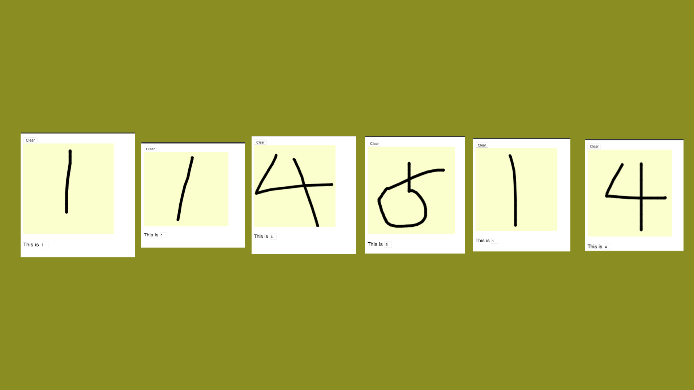

# NN_MNIST

A super simple, zero dependency, hand-written from scratch NN to recognize handwritten digits from MNIST
 dataset. It consists of 3 fully-connected layers and is trained using gradient descent.
 
With 200 neurons in the hidden layer and 5 epochs it achieves about 96.5% accuracy rate on the test dataset.

For the gradient descent algorithm to execute in a reasonable time, this version has 30 neurons in the hidden layer and the iteration goes on only through 1 epoch. It achieves about 92% accuracy.